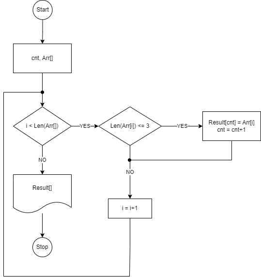

# Итоговая проверочная работа
Ссылка на [репозиторий гитхаб](https://github.com/s3rgs3m/Itog1)

**Задача:** Написать программу, которая из имеющегося массива строк формирует массив из строк, длина которых меньше либо равна 3 символа. Первоначальный массив можно ввести с клавиатуры, либо задать на старте выполнения алгоритма.

**Описание решения**

1. будет использоваться заданный массив без ввода с клавиатуры, т.к. условия задачи позволяют
2. алгоритм выполнения задачи:
    * открыть перебор по начальному массиву;
    * проверить длину строки текущего элемента;
    * если длина >= 3, то добавить текущий элемент к новому массиву;
    * после окончания перебора, вывести новый массив на экран

